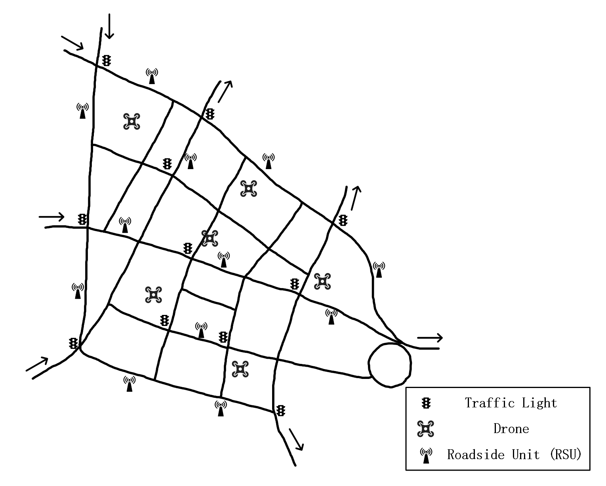
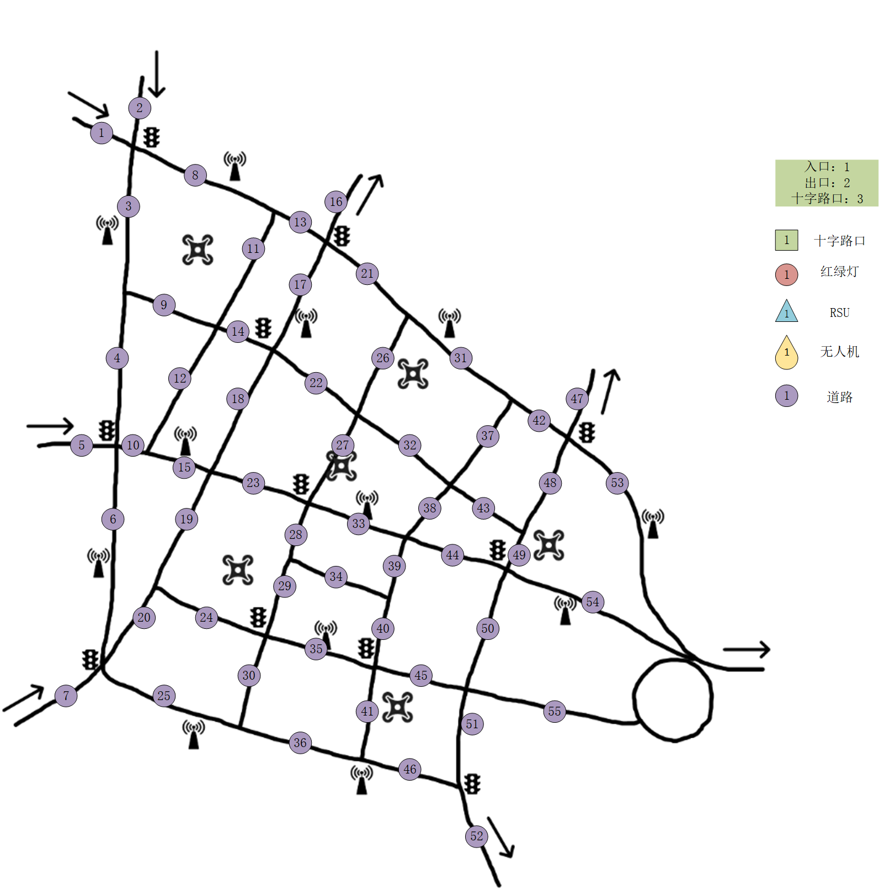
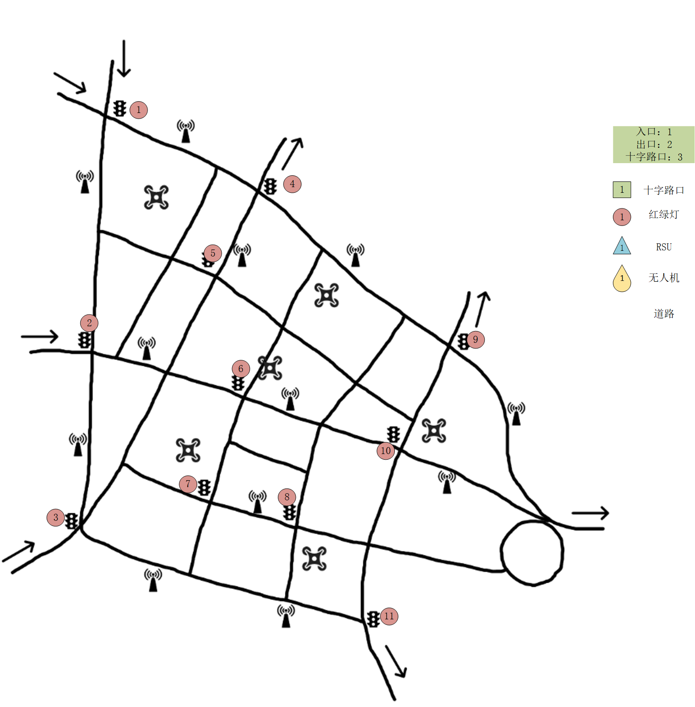
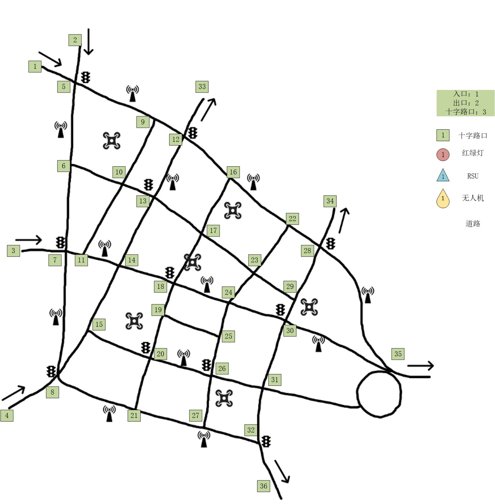
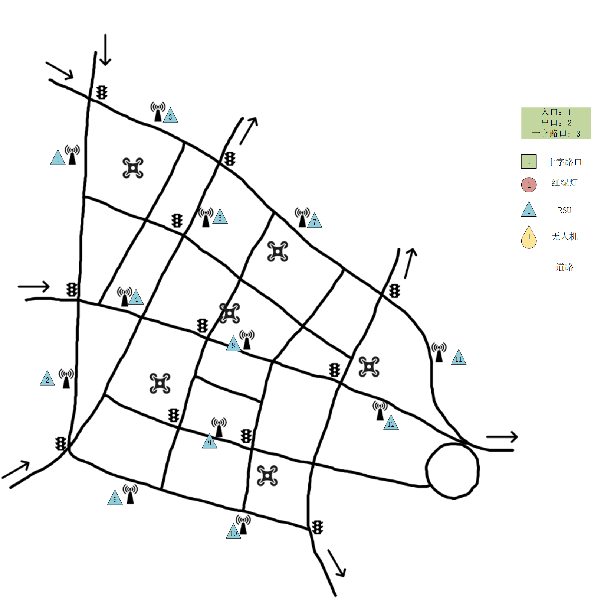
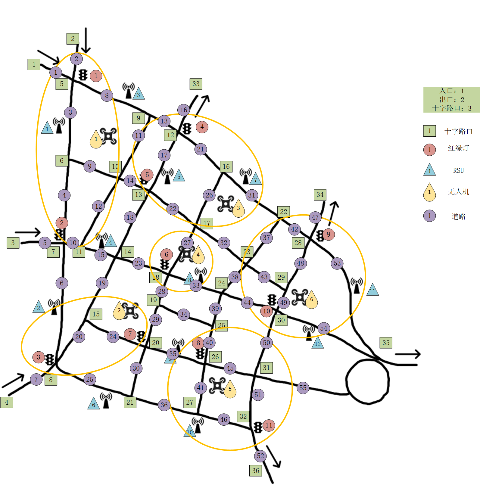

# 一、拓扑图
道路拓扑图实际取景于天津市意大利风情旅游区周边道路。在该道路拓扑图中，设定4个分布于左侧的入口和4个分布于右侧的出口，使车辆的整体行驶方向为从左到右。选路范围涵盖了多条主要通行路线，车辆在进入后可以根据当前交通状况选择最佳路径。

红绿灯（Traffic Light）系统分布在各主要交叉路口，以控制车辆的通行顺序，共设置了约11个红绿灯，确保交通流畅。路侧单元（RSU）共部署了12个，分布在道路两侧的重要节点，用于处理任务卸载请求，提升车辆计算能力。

此外，无人机（Drone）在空中飞行，实时收集车辆的位置信息并对红绿灯进行动态调整，优化交通流量，减少等待时间。
## 1. 道路拓扑图

## 2. 边编号图

## 3. 红绿灯编号图

## 4. 路口编号图

## 5. 无人机编号图

## 5. RSU编号图

## 6. 汇总叠加图

# 二、排队时延、传输时延、计算时延

## 1. 排队时延  $T_q$

### 定义

排队时延描述了任务在边缘单元的服务队列中等待被处理的时间。对于车辆发出的任务请求，可能因边缘单元负载较高而需要等待。

### 公式

$$
T_q = \frac{\lambda \cdot E[S^2]}{2 \cdot (1 - \lambda \cdot E[S])}
$$

### 参数含义

- $\lambda $：任务到达率，表示单位时间内到达边缘节点的任务数量，它反映了系统的输入负载强度。单位为任务/秒
- $E[S]$：任务的平均服务时间，即边缘单元处理单个任务的时间，其包括计算时延和其它开销时延。单位为秒/任务。
- $E[S^2]$：服务时间的二阶矩，用于描述服务时间的波动性。

## 2. 传输时延 $T_ {\text{tra}}$

### 定义

传输时延是数据从车辆传输到边缘节点的时间，包含信道传播、网络争用和数据传输。

### 公式

$$
T_{\text{tra}} = T_{\text{pro}} + T_{\text{contention}} + T_{\text{transmission}}
$$

- **信道传播时延**：

$$
T_{\text{pro}} = \frac{d}{v}
$$

- **网络争用时延**：

$$
T_{\text{contention}} = E[N] \cdot T_{\text{slot}}
$$

  其中：
  
 $$
 T_{\text{slot}} = P_{\text{idle}} \cdot T_{\text{idle}} + P_c \cdot T_{\text{collision}} + P_s \cdot T_{\text{success}}
 $$
 
- **数据传输时延**：
 
 $$
 T_{\text{transmission}} = \frac{L}{C}
 $$
 
### 参数含义

1. **信道传播时延 $T_{\text{pro}}$**：
   
   - $d$：车辆到边缘节点的物理距离，单位为米。
   - $v$：信号传播速度，单位为米/秒。
2. **网络争用时延 $T_{\text{contention}}$**：
   
   - $E[N]$：平均争用次数。
   - $P_{\text{idle}}, P_c, P_s$：空闲、冲突、成功传输的概率。
   - $T_{\text{idle}}, T_{\text{collision}}, T_{\text{success}}$：空闲、冲突、成功传输时隙的时长（单位：秒）。
3. **数据传输时延 $ T_{\text{transmission}} $**：
   
   - $L$：数据包的大小，单位为比特。
   - $C$：信道容量，单位为比特/秒。

## 3. 计算时延 $T_ {\text{cal}}$

### 定义

计算时延是任务在边缘节点被处理所需的时间，与任务复杂度和计算资源相关。

### 公式

$$
T_{\text{cal}} = \frac{k \cdot L}{i \cdot \mu_t}
$$

### 参数含义

1. **任务复杂度 $k \cdot c$**：
   
   - $k$：计算复杂度因子，表示每比特数据需要执行的计算量（单位：FLOPs/比特）。k 的值取决于任务类型和算法。
   - $L$：数据包大小，单位为比特。
2. **计算资源分配**：
   
   - $i$：分配的计算资源单元数量（如 CPU 核数）。
   - $\mu_t$：每个计算资源单元的计算能力，单位为 FLOPs/秒。

## 4. 完整通信总时延

完整的通信总时延为：

$$
T_{\text{total}} = T_{\text{tra}} + T_q + T_{\text{cal}} 
$$

# 三、性能指标

## 1. 任务卸载平均处理延时

**计算公式**:

$$
T_{avg} = \frac{1}{N} \sum_{i=1}^{N} T_i
$$

**参数**:

* $T_i$: 第 $i$ 个任务的处理延时
* $N$: 任务总数

## 2. RSU总车辆服务数量

**计算公式**:

$$
S_{RSU} = \sum_{j=1}^{M} C_j
$$

**参数**:

* $C_j$: 第 $j$ 个 RSU 服务的车辆数量
* $M$: RSU 总数

## 3. RSU边缘计算吞吐量

**计算公式**:

$$
H = \frac{\sum_{k=1}^{P} D_k}{T}
$$

**参数**:

* $D_k$: 第 $k$ 个任务的计算数据量
* $P$: 总任务数
* $T$: 总处理时间

## 4. 车辆在红绿灯处的平均等待时间

**计算公式**:

$$
W_{avg} = \frac{1}{Q} \sum_{l=1}^{Q} W_l
$$

**参数**:

* $W_l$: 第 $l$ 辆车的等待时间
* $Q$: 红绿灯前的总车辆数量

## 5. 交通流量

**计算公式**:

$$
F = \frac{N_{v}}{T_{interval}}
$$

**参数**:

* $N_{v}$: 在特定时间段内通过的车辆数量
* $T_{interval}$: 该时间段的持续时间（单位：小时）

# 四、json字段说明

### Car.json
**字段说明**：
- `id`: 车辆的唯一标识符。
- `offload_probability`: 任务卸载的概率，表示车辆有多大可能将计算任务卸载到路边单元（RSU）。
- `latency_requirement`: 车辆对任务处理的时延要求，以秒为单位。
- `position`: 车辆的当前位置，表示为坐标列表 `[x, y]`。
- `speed`: 车辆的行驶速度，以 km/h 为单位。
- `entry_node`: 车辆进入道路网络的节点。
- `exit_node`: 车辆从道路网络出去的节点。
- `edge_id`: 车辆当前所在道路段的 ID。

### Drone.json
**字段说明**：
- `id`: 无人机的唯一标识符。
- `position`: 无人机的当前位置，表示为坐标列表 `[x, y, z]`，其中 `z` 为高度。
- `computation_capacity`: 无人机的计算能力，以某单位表示。
- `concurrency_capacity`: 无人机同时处理任务的能力，表示它可以同时执行的任务数。

### Node.json
**字段说明**：
- `id`: 节点的唯一标识符。
- `position`: 节点的位置，表示为坐标列表 `[x, y]`。
- `node_type`: 节点类型，数字表示，如1、2、3等，具体类型需要根据系统设计确定。
- `traffic_light_node`: 是否有交通灯控制的节点，数字标识（例如0为无交通灯，1为有）。
- `rsu_ids`: 与此节点关联的 RSU（路边单元）的 ID 列表。
- `drone_ids`: 与此节点关联的无人机的 ID 列表。

### Road.json
**字段说明**：
- `id`: 道路段的唯一标识符。
- `node1`: 道路起点的节点 ID。
- `node2`: 道路终点的节点 ID。
- `length`: 道路长度，单位为米。

### Traffic_light.json
**字段说明**：
- `id`: 交通灯的唯一标识符。
- `current_state`: 交通灯的当前状态，数字表示（如1为绿灯，2为红灯等）。
- `remaining_time`: 交通灯当前状态剩余时间，单位为秒。
- `durations`: 交通灯每个状态的持续时间列表，以秒为单位。

### RSU.json
**字段说明**：
- `id`: 路边单元（RSU）的唯一标识符。
- `computation_capacity`: RSU的计算能力，以某单位表示。
- `concurrency_capacity`: RSU可以同时处理的任务数量。

# 五、强化学习

以下是针对车辆任务卸载到路侧单元（RSU）问题的POMDP建模，目标是通过强化学习优化任务分配策略，最小化任务处理延时。

---

# **1. 部分可观察马尔可夫决策过程（POMDP）建模**

#### **1.1 状态空间 (State,**$S_t$**)**

全局状态包括车辆与RSU的任务和网络信息。状态定义为：

$$
S_t = \{\sum_{i=1}^MV_{i,t}, \sum_{j=1}^NR_{j,t}, \sum_{i=1}^M\sum_{j=1}^NNet_{(i,j),t}\}
$$

* $V_{i,t} = \{D_{i,t}, \tau_{i,t}, p_{i,t}\}$, $V_{i,t}$ 是车辆 $i$ 在时间 $t$ 的状态向量，包含以下信息：

  * $D_{i,t}$：车辆 $i$ 当前时间槽生成的任务数据大小（单位：KB）。
  * $\tau_{i,t}$：车辆 $i$ 的任务延迟需求（单位：ms）。
  * $p_{i,t}$：车辆 $i$ 的计算能力（单位：CPU MHz）。
* $R_{j,t} = \{C_{j,t}, Q_{j,t}\}$, $R_{j,t}$ 是 RSU $j$ 在时间 $t$ 的状态向量，包含以下信息：

  * $C_{j,t}$：RSU $j$ 的当前计算资源（单位：CPU MHz）。
  * $Q_{j,t}$：RSU $j$ 的任务队列长度（单位：任务数）。
* $Net_{(i,j),t} = \{B_{(i,j),t}, S_{(i,j),t}\}$, $Net_{(i,j),t}$是车辆 $i$ 与 RSU $j$ 的网络状态，包含以下信息：

  * $B_{(i,j),t}$：车辆 $i$ 与 RSU $j$ 的通信带宽（单位：MHz）。
  * $S_{(i,j),t}$：车辆 $i$ 与 RSU $j$ 的信道质量（单位：信噪比，dB）。

---

#### **1.2 观测空间 (Observation,**$O_t$**)**

由于部分可观察，车辆只能观测到自身信息及服务范围内RSU的部分状态。观测定义为：

$$
O_{t}=\{V_{t},\{R_{k,t},Net_{k,t}\}\mid 
 k\in\mathcal{K}\}
$$

其中：

**$\mathcal{K}$**：车辆服务范围内的 RSU 集合。

---

#### **1.3 动作空间 (Action,**$a_t$**)**

动作是任务分配策略，定义为任务分配比例向量：

$$
a_t = [w_1, w_2, \dots, w_K] , 
 k\in\mathcal{K}
$$

* $w_k \in [0, 1]$：表示任务分配给服务范围内RSU $k$ 的比例。
* 满足约束: $\sum_{k=1}^K w_k = 1$

---

#### **1.4 奖励函数 (Reward,**$R_t$**)**

奖励函数用于量化动作的好坏，目标是最小化任务总延时。奖励函数通过以下两个主要部分来表示：

$$
R(T_{total},E)=\alpha\cdot R_{T}(T_{total})+\beta\cdot R_{E}(E)
$$

其中 $\alpha$ 和 $\beta$ 分别代表延时和能耗在奖励函数中的权重，满足 $\alpha + \beta = 1$。

###### 延时奖励 $R_T(T_{\text{total}})$：

  根据总延时 $T_{\text{total}}$ 相对于阈值进行分段：

$$
R_T(T_{\text{total}}) =
\begin{cases}
1 & \text{若 } T_{\text{total}} \leq T_{\text{ideal}} \\
\frac{T_{\text{acpt}} - T_{\text{total}}}{T_{\text{acpt}} - T_{\text{ideal}}} & \text{若 } T_{\text{ideal}} < T_{\text{total}} \leq T_{\text{acpt}} \\
0 & \text{若 } T_{\text{total}} > T_{\text{acpt}}
\end{cases}
$$

  其中：

  * $T_{\text{total}}$：为排队时延 $T_{\text{tra}}$、传输时延 $T_q$、计算时延 $T_{\text{cal}}$的总和。即 $T_{\text{total}} = T_{\text{tra}} + T_q +T_{\text{cal}}$
  * $T_{\text{ideal}}$：系统期望达到的最佳延时。
  * $T_{\text{acpt}}$：任务卸载过程仍可接受的最大延时。
* ###### 能耗奖励 $R_E(E)$

  根据能耗 $E$ 是否超过阈值进行分段：

$$
R_E(E) =
\begin{cases}
1 & \text{若 } E \leq E_{\text{max}} \\
\frac{E_{\text{max}}}{E} & \text{若 } E > E_{\text{max}}
\end{cases}
$$

  其中：

  * $E$：任务卸载过程中的能量消耗。
  * $E_{\text{max}}$：允许的最大能耗

最终将综合奖励函数 $R(T_{\text{total}}, E)$展开得到如下分段函数：

$$
R(T_{\text{total}}, E) =
\begin{cases}
\alpha \cdot 1 + \beta \cdot 1 & \text{若 } T_{\text{total}} \leq T_{\text{ideal}} \text{ 且 } E \leq E_{\text{max}} \\
\alpha \cdot \frac{T_{\text{acpt}} - T_{\text{total}}}{T_{\text{acpt}} - T_{\text{ideal}}} + \beta \cdot 1 & \text{若 } T_{\text{ideal}} < T_{\text{total}} \leq T_{\text{acpt}} \text{ 且 } E \leq E_{\text{max}} \\
\alpha \cdot 0 + \beta \cdot 1 & \text{若 } T_{\text{total}} > T_{\text{acpt}} \text{ 且 } E \leq E_{\text{max}} \\
\alpha \cdot 1 + \beta \cdot \frac{E_{\text{max}}}{E} & \text{若 } T_{\text{total}} \leq T_{\text{ideal}} \text{ 且 } E > E_{\text{max}} \\
\alpha \cdot \frac{T_{\text{acpt}} - T_{\text{total}}}{T_{\text{acpt}} - T_{\text{ideal}}} + \beta \cdot \frac{E_{\text{max}}}{E} & \text{若 } T_{\text{ideal}} < T_{\text{total}} \leq T_{\text{acpt}} \text{ 且 } E > E_{\text{max}} \\
\alpha \cdot 0 + \beta \cdot \frac{E_{\text{max}}}{E} & \text{若 } T_{\text{total}} > T_{\text{acpt}} \text{ 且 } E > E_{\text{max}}
\end{cases}
$$

---

#### **1.6 策略目标**

优化目标是最大化长期累积奖励，即：

\[ \max_{\pi} \mathbb{E}_\pi \left[\sum_{t=0}^\infty \gamma^t R_t\right] \]

* $\pi$：任务分配策略，定义为在观测 $o_t$ 下选择动作 $a_t$ 的概率分布。

* $\gamma \in [0, 1]$：折扣因子，控制未来奖励的权重。

# **六、强化学习算法**

> 如果后面的看不上，在这挑一个看看有没有看得上的
>
> ### 推荐算法综述
>
> * **MADDPG**：适合需要连续动作空间和高度协作的任务卸载场景，能够通过集中训练提升智能体协调能力。
> * **QMIX**：适用于大规模智能体系统和离散动作空间，通过值函数的混合确保全局最优性。
> * **COMA**：通过反事实基准解决信用分配问题，适合需要精确策略协作的复杂任务卸载场景。
> * **MAPPO**：结合 PPO 的稳定性和多智能体扩展，适用于多样化任务卸载需求。
> * **GCRL**：利用图卷积网络建模智能体关系，适合智能体间关系复杂且动态变化的场景。
> * **Attention-based MARL**：通过注意力机制优化信息处理和协作，适合信息动态变化且智能体数量众多的环境。
> * **MF-MARL**：通过均值场近似提升大规模系统的处理能力，适合车联网中大量车辆的任务卸载。
> * **MASAC**：结合 SAC 的探索性和稳定性，适用于需要高探索性的任务卸载策略。
> * **CTDE Framework**：灵活适用于多种 MARL 算法，确保集中训练和分散执行的平衡。
> * **HMARL**：通过层次化策略处理复杂任务，适合多层次优化需求的车联网任务卸载。

### **1. HMARL的基本原理**

#### **1.1 层次化强化学习的概念**

层次化强化学习（Hierarchical Reinforcement Learning, HRL）是一种将复杂任务分解为多个层次子任务的方法。HRL通过引入高层次的策略（如宏观策略）和低层次的策略（如微观策略），使得智能体能够在不同的抽象层次上进行决策。这种方法不仅简化了学习过程，还提高了策略的可解释性和可复用性。

#### **1.2 多智能体系统中的层次化**

在多智能体系统中，每个智能体可能面临独立或协作的任务。HMARL在此基础上进一步引入层次结构，使得多个智能体能够在不同层次上协调和合作。通常，HMARL包括以下两个主要层次：

1. **高层策略（Manager/Meta-Controller）** ：负责规划和分配子任务，制定整体任务的宏观决策。
2. **低层策略（Worker/Controller）** ：执行具体的子任务，完成由高层策略分配的微观决策。

---

### 2 **. HMARL的实现步骤**

#### 2 **.1 任务分解**

首先，需要将任务卸载问题分解为多个层次的子任务：

* **高层任务**：任务分配与规划，决定每辆车的任务分配比例。
* **低层任务**：具体的任务执行，如数据传输、计算资源调度等。

#### 2 **.2 设计高层与低层智能体**

* **高层智能体**：

  **输入**：全局或汇总的系统状态信息。
  **输出**：任务分配比例向量 $[w_1, w_2, \dots, w_K]$。
  **学习方法**：采用集中式强化学习方法，如集中式训练的策略梯度方法或基于值的学习方法。
* **低层智能体**：

  **输入**：局部状态信息和高层分配的任务比例 $w_k$。
  **输出**：具体的执行动作，如调整传输速率、执行本地计算等。
  **学习方法**：采用分散式强化学习方法，独立学习自己的策略，或结合集中式训练方法共享部分信息。

#### 2 **.3 训练策略**

###### 2 **.3.1 集中式训练**

在训练阶段，高层智能体可以访问所有智能体的状态和动作信息，利用这些信息进行全局优化。这种方法有助于智能体学习到更协调和高效的策略。

###### 2 **.3.2 分散式执行**

在执行阶段，每个智能体仅基于自身的观测和接收到的任务指令进行决策。这种方法确保了系统的可扩展性和实时性，适应车联网中信息的局部性和动态性。

###### 2 **.4 协同与通信机制**

确保高层和低层智能体之间的有效通信：

* **高层到低层**：高层智能体将任务分配比例传递给各低层智能体。  
$a_t^{high} = [w_1, w_2, \dots, w_K]$
* **低层到高层**：低层智能体将执行结果（如实际延时、能耗）反馈给高层智能体，用于策略的进一步优化。  
$R_t^{low} = \alpha \cdot R_T(T_{\text{total}}) + \beta \cdot R_E(E)$

---

### 3 **. 数学模型**

在HMARL中，整个系统可以被建模为多个嵌套的POMDP（部分可观察马尔可夫决策过程），其中每个层次的智能体都有自己的状态、观测、动作和奖励函数。

#### 3 **.2.1 高层POMDP**

* **状态空间**：全局状态 $S_t^{high}$
* **观测空间**：全局观测 $O_t^{high}$
* **动作空间**：任务分配策略 $a_t^{high}$
* **奖励函数**：全局奖励 $R_t^{high}$

#### 3 **.2.2 低层POMDP**

**状态空间**：局部状态 $S_t^{low}$
**观测空间**：局部观测 $O_t^{low}$
**动作空间**：具体执行动作 $a_t^{low}$
**奖励函数**：局部奖励 $R_t^{low}$

### 3 **.3 任务卸载场景中的层次化设计**

为HMARL设计了如下层次结构：

#### 3 **.3.1 高层策略：任务分配与规划**

**输入**：所有车辆和RSU的状态信息，如任务生成速率、RSU的负载、网络带宽等。

$$
S_t^{high} = \left\{ \sum_{i=1}^M V_{i,t}, \sum_{j=1}^N R_{j,t}, \sum_{i=1}^M \sum_{j=1}^N \text{Net}_{(i,j),t} \right\}
$$
**动作**：为每辆车分配任务卸载比例向量 $a_t^{high} = [w_1, w_2, \dots, w_K]$，其中 $w_k$ 表示任务分配给RSU $k$ 的比例。
**奖励**：基于全局系统性能，即总延时和总能耗。

$$
R_t^{high} = \alpha \cdot R_T(T_{\text{total}}) + \beta \cdot R_E(E)
$$

#### 3 **.3.2 低层策略：具体任务执行**

**输入**：自身的局部状态 $S_t^{low}$ 和高层分配的任务比例 $w_k$。

$$
S_t^{low} = \{V_{t},\{R_{k,t},Net_{k,t}\}\mid 
k\in\mathcal{K}\}
$$
**动作**：执行具体的传输和计算策略，如调整传输速率 $r_t$、选择传输路径 $p_t$ 等。
**奖励**：基于自身执行效果，即实际延时和能耗。

$$
R_t^{low} = \alpha \cdot R_T(T_{\text{total}}) + \beta \cdot R_E(E)
$$

---

### 4 **. HMARL的数学表达式与优化过程**

#### 4 **.1 高层策略的决策过程**

高层策略需要决定每辆车的任务分配比例 $a_t^{high}$，目标是最大化全局累积奖励。高层的优化目标可以表示为：

$\max_{\pi^{high}} \mathbb{E}_{\pi^{high}} \left[ \sum_{t=0}^\infty \gamma^t R_t^{high} \right]$

其中：

$\pi^{high}$ 是高层策略。
$\gamma \in [0,1]$ 是折扣因子。

#### 4 **.2 低层策略的决策过程**

低层策略根据高层分配的任务比例 $w_k$ 执行具体动作，目标是最大化局部累积奖励。低层的优化目标可以表示为：

$\max_{\pi^{low}} \mathbb{E}_{\pi^{low}} \left[ \sum_{t=0}^\infty \gamma^t R_t^{low} \right]$

其中：

$\pi^{low}$ 是低层策略。
$\gamma \in [0,1]$ 是折扣因子。

#### 4 **.3 协同优化**

高层和低层策略需要协同优化，以实现整体系统的最优性能。数学上，这可以通过联合优化高层和低层策略来实现：

$$
\max_{\pi^{high}, \pi^{low}} \mathbb{E}_{\pi^{high}, \pi^{low}} \left[ \sum_{t=0}^\infty \gamma^t (R_t^{high} + R_t^{low}) \right]
$$
